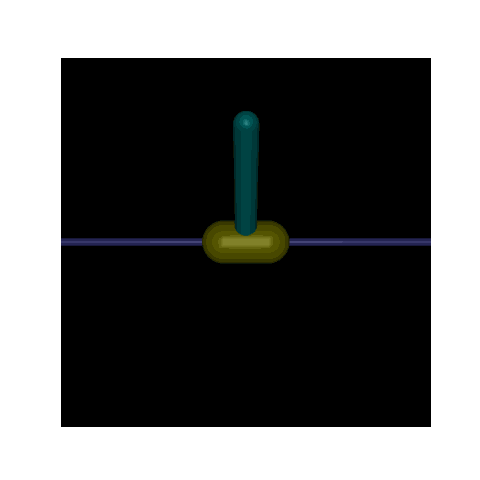

# CartPole_RL


本项目实现了基于DQN（Deep Q-Network）的倒立摆强化学习智能体，目标是让小车在MuJoCo物理引擎环境下稳定地保持倒立摆竖直，同时尽量避免小车越界。

```
CartPole_RL/
│
├── envs/                 # 环境相关代码
│   └── cartpole_env.py   # 倒立摆环境
│
├── models/               # 模型相关代码
│   └── dqn.py            # DQN算法
│
├── utils/                # 工具函数
│   ├── replay_buffer.py  # 经验回放缓冲区
│   └── visualization.py  # 可视化工具
│
├── train.py              # 训练脚本
├── test.py               # 测试脚本
├── config.py             # 配置参数
└── README.md             # 项目说明
```
1. 安装依赖
```
pip install gymnasium mujoco numpy matplotlib tqdm
```
1. 训练模型
```
python train.py
```
1. 测试模型
```
python test.py
```
1. 生成可视化结果`.gif`
```
python utils/visualization.py
```

